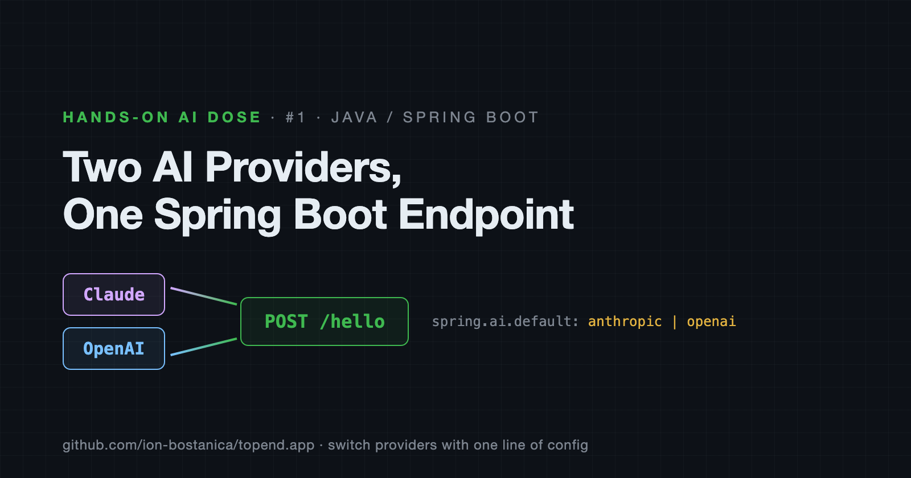
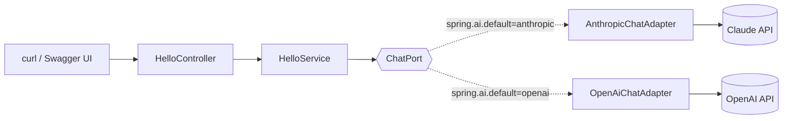
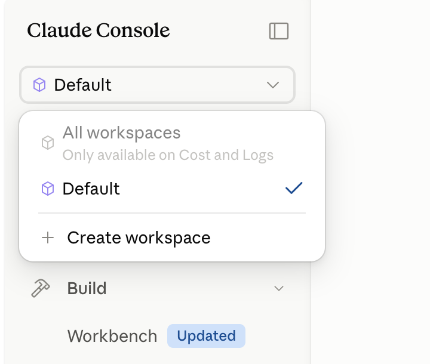
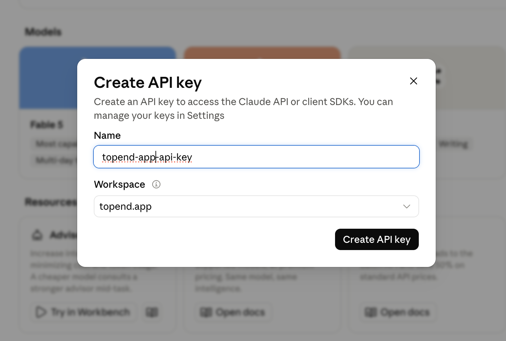
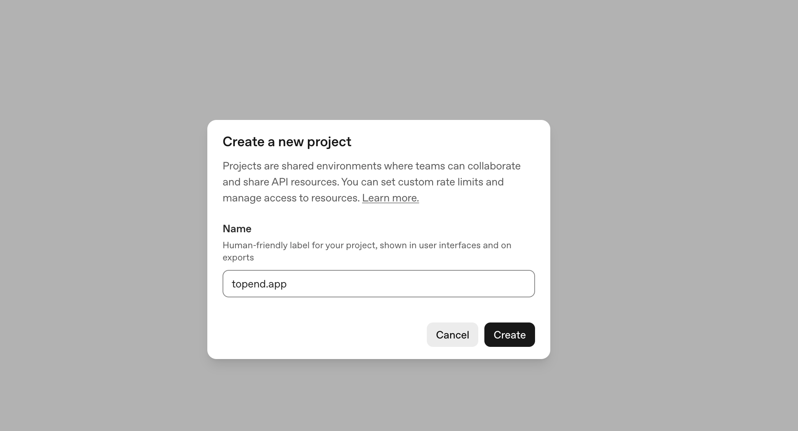
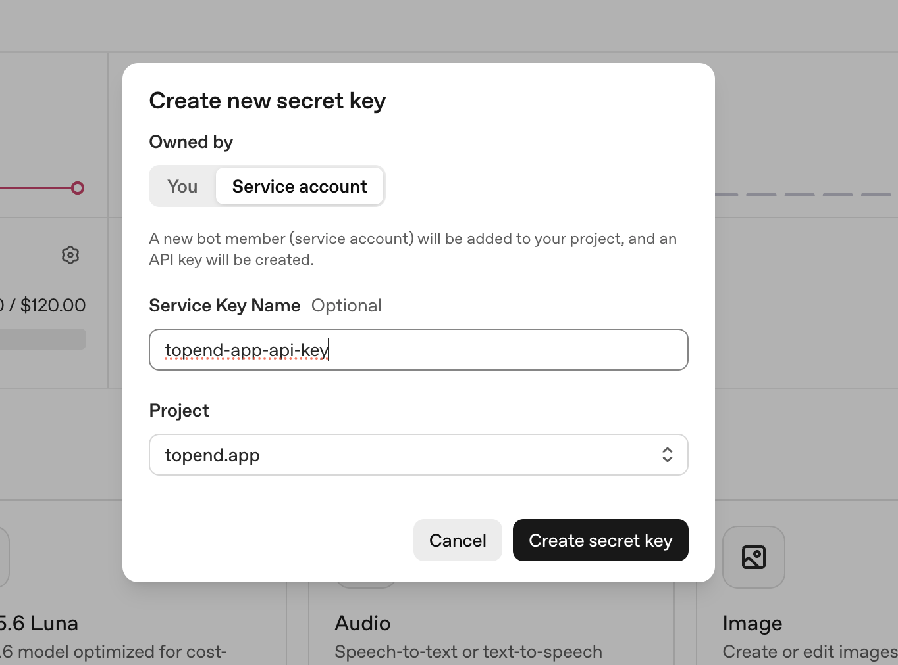
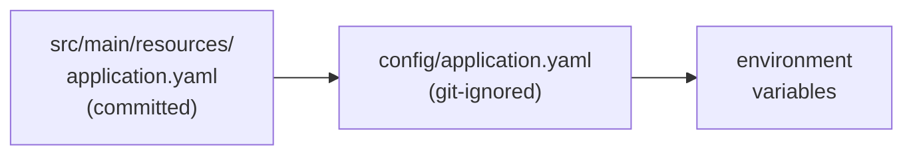
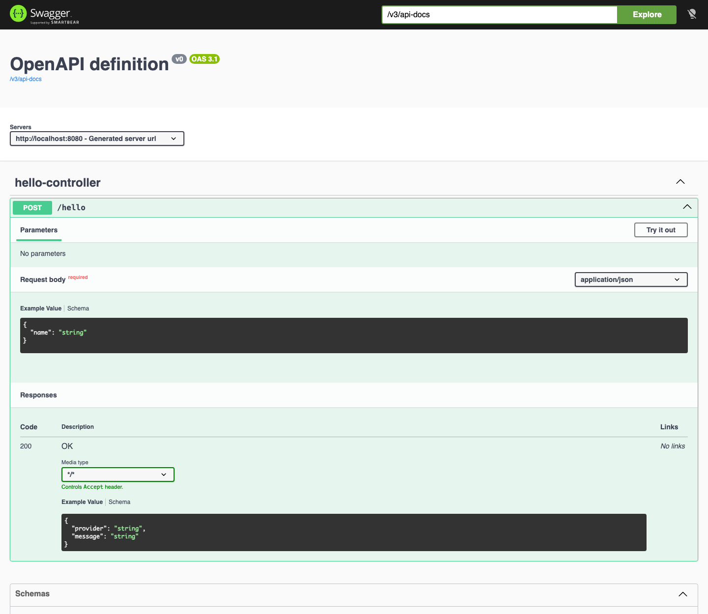

# Hands-On AI Dose #1 — Two AI Providers, One Spring Boot Endpoint

*Claude and OpenAI, wired into the same Spring Boot API, switchable with one line of config.*



---

## Why this series

1. **Java is underserved.** Most hands-on AI content is Python. Almost none of it is bite-sized.
2. **Every article ships code.** One GitHub tag per article, so the repo always matches what you're reading.
3. **You can fork the idea.** I'm building a fitness app. Follow along and build something else with the same moves.
4. **Starts beginner-friendly, gets harder.** Day 1 is a `/hello` endpoint. It won't stay that way.

**Today:** scaffold the project, get both API keys, and call Claude *and/or* OpenAI from the same endpoint.

---

## What we're building



One endpoint. Two providers. The switch is a config value, not an `if`.

---

## Prerequisites

**Java 26.** Spring Boot 4.1 runs on 17 and up, but this repo pins `java.version` to 26 — you need JDK 26 to build it.

```bash
java -version                                # expect 26
export JAVA_HOME=$(/usr/libexec/java_home -v 26)   # macOS
```

**Maven** — the project ships the wrapper (`./mvnw`), so a system Maven is optional. If you want one:

```bash
mvn -version
export MAVEN_HOME=/opt/homebrew/opt/maven/libexec   # macOS/homebrew
```

**Docker** — must be running before you start the app. Spring Boot's Docker Compose support looks for the daemon at startup and fails fast if it isn't there.

```bash
docker info >/dev/null && echo "docker ok"
```

Starting the app also starts Mongo, so this is the only command you need:

```bash
export JAVA_HOME=$(/usr/libexec/java_home -v 26)
cd api && ./mvnw spring-boot:run
```

---

## Step 1 — Scaffold

[start.spring.io](https://start.spring.io/) → Maven, Java 26, Spring Boot 4.1.0, group `app.topend`, artifact `api`, YAML config.

### Dependencies we use today

| Dependency | Why |
|---|---|
| **Spring Reactive Web** (WebFlux) | Non-blocking stack on Netty. An AI call is slow I/O — one thread per in-flight request would be pure waste. |
| **Anthropic Claude** | Spring AI starter for Claude. Gives us an `AnthropicChatModel` bean configured from YAML. |
| **OpenAI** | Same, for OpenAI. Gives us an `OpenAiChatModel` bean. |
| **springdoc-openapi** | Generates the OpenAPI spec from the controllers and serves Swagger UI on top of it. This is the dependency behind Step 9. |
| **Docker Compose Support** | Brings up everything in `compose.yaml` with the app and takes it down again on shutdown. |
| **Spring Boot DevTools** | Restarts the app on save. You'll be flipping config a lot today. |
| **Spring Configuration Processor** | IDE autocomplete for config keys — useful when the whole feature is driven by YAML. |

springdoc isn't on the Initializr list, so add it to the pom:

```xml
<dependency>
    <groupId>org.springdoc</groupId>
    <artifactId>springdoc-openapi-starter-webflux-ui</artifactId>
    <version>3.1.0</version>
</dependency>
```

> Note the `-webflux-ui` suffix. The `-webmvc-ui` variant silently does nothing on a reactive stack.

### Dependencies for later

Selected now so the project doesn't churn, unused in today's code:

| Dependency | What it's for |
|---|---|
| **Spring Data Reactive MongoDB** | Persistence, on the reactive driver. Today's endpoint is a sample — it answers and forgets. Once this turns into real functionality that has to store something (conversation history, a user profile, a workout log), this is what it stores it with. |
| **Spring Modulith** | Verifies module boundaries at build time and traces calls between them at runtime. Pays off once there are several features, not one. |
| **Spring Boot Actuator** | Health, metrics, and info endpoints. What you point a container orchestrator or a dashboard at. |
| **Spring REST Docs** | Generates API documentation from passing tests, so the docs can't drift from real behaviour. Complements Swagger rather than replacing it. |

---

## Step 2 — Claude API key

Go to [platform.claude.com](https://platform.claude.com/).

**Add credit first.** A new account has a zero balance and every call fails with a billing error, which looks exactly like a broken key.

Then create a workspace — it keeps this project's spend separate from everything else you do:



Create the key inside that workspace and copy it now. You only see it once.



---

## Step 3 — OpenAI API key

Go to [platform.openai.com](https://platform.openai.com/).

Same deal: **add credit first**.

One extra step — **verify your identity**. Without it you're stuck in the default project and can't create new ones.



Create a project, then a key scoped to it:



> ⚠️ I gave this key full permissions because it'll be used across the whole series. For anything real, scope it down to only what you call.

---

## Step 4 — Configuring API keys

Two keys now exist and neither can go in git. Spring Boot reads a `config/` folder next to the app automatically, and later sources win:



Committed file — defaults and placeholders only:

```yaml
# api/src/main/resources/application.yaml
spring:
  ai:
    default: anthropic          # anthropic | openai
    anthropic:
      api-key: ${ANTHROPIC_API_KEY:}
      chat:
        model: claude-haiku-4-5
        max-tokens: 100
    openai:
      api-key: ${OPENAI_API_KEY:}
      chat:
        model: gpt-5-nano
        max-completion-tokens: 512
```

Local file — real keys, never committed:

```yaml
# api/config/application.yaml
spring:
  ai:
    default: openai
    anthropic:
      api-key: sk-ant-...
    openai:
      api-key: sk-proj-...
```

```gitignore
# api/.gitignore
/config/
!/config/*.example
```

So: the committed file holds the shape and the defaults, the ignored file holds the two secrets and my current provider choice.

---

## Step 5 — Local stack

A compose file next to the pom:

```yaml
# api/compose.yaml
services:
  mongo:
    image: mongo:8
    ports:
      - "27017"
```

That's it. `spring-boot-docker-compose` starts Mongo when the app starts, stops it when the app stops, and wires the connection string in for you. No `docker compose up` in your muscle memory.

---

## Step 6 — Packaging: bare-bones hexagonal

One reason today: **provider pluggability**.

If `HelloService` imports `AnthropicChatModel`, then adding OpenAI means editing `HelloService`. Three providers means an `if/else` ladder sitting in the middle of business logic.

So the service depends on an interface it owns — a **port** — and each provider gets a small class implementing it — an **adapter**:

```
hello/
├── domain/                     HelloResponse
├── application/
│   ├── port/in/                HelloUseCase      ← what the app offers
│   ├── port/out/               ChatPort          ← what the app needs
│   └── HelloService            ← knows neither provider
└── adapter/
    ├── in/web/                 HelloController
    └── out/ai/                 AnthropicChatAdapter, OpenAiChatAdapter
```

That's the whole idea for today. Adding a third provider = one new file, nothing else touched.

Whether this layout is worth its ceremony is a fair question, and it's the wrong one to answer with a single feature in the repo. We'll come back to it once Modulith has more than one module to enforce — that's when the boundaries either earn their keep or get flattened.

---

## Step 7 — The code

Following the request, outside in.

### 1. The controller — the way in

```java
@RestController
public class HelloController {

    private final HelloUseCase hello;

    public HelloController(HelloUseCase hello) {
        this.hello = hello;
    }

    public record HelloRequest(String name) {}

    @PostMapping("/hello")
    public Mono<HelloResponse> hello(@RequestBody HelloRequest request) {
        if (request.name() == null || request.name().isBlank()) {
            throw new ResponseStatusException(HttpStatus.BAD_REQUEST, "name is required");
        }
        return hello.hello(request.name());
    }
}
```

It knows HTTP and nothing else. It depends on `HelloUseCase`, not on a service class.

### 2. The inbound port — what the app offers

```java
public interface HelloUseCase {
    Mono<HelloResponse> hello(String name);
}
```

```java
public record HelloResponse(String provider, String message) {}
```

### 3. The service — the actual behaviour

```java
@Service
public class HelloService implements HelloUseCase {

    private final ChatPort chat;

    public HelloService(ChatPort chat) {
        this.chat = chat;
    }

    @Override
    public Mono<HelloResponse> hello(String name) {
        return chat.chat("Say hello to " + name + " in one short sentence.")
            .map(message -> new HelloResponse(chat.provider(), message));
    }
}
```

No provider anywhere in sight. It asks for a prompt to be answered and labels the result.

### 4. The outbound port — what the app needs

```java
public interface ChatPort {
    Mono<String> chat(String prompt);
    String provider();
}
```

### 5. The adapters — the way out

Identical except for the model type and the config value:

```java
@Component
@ConditionalOnProperty(name = "spring.ai.default", havingValue = "anthropic")
public class AnthropicChatAdapter implements ChatPort {

    private final AnthropicChatModel chatModel;

    public AnthropicChatAdapter(AnthropicChatModel chatModel) {
        this.chatModel = chatModel;
    }

    @Override
    public Mono<String> chat(String prompt) {
        return Mono.fromCallable(() -> chatModel.call(prompt))
            .subscribeOn(Schedulers.boundedElastic());
    }

    @Override
    public String provider() {
        return "anthropic";
    }
}
```

```java
@Component
@ConditionalOnProperty(name = "spring.ai.default", havingValue = "openai")
public class OpenAiChatAdapter implements ChatPort {

    private final OpenAiChatModel chatModel;
    // ...identical body, provider() returns "openai"
}
```

`@ConditionalOnProperty` is what makes the switch work: exactly one adapter bean exists at runtime, so Spring injects it into `HelloService` with zero ambiguity.

Seven small files. That's the feature.

Plus one test — `HelloControllerTest` is a `@WebFluxTest` slice with `HelloUseCase` mocked out. It checks the response shape and the 400, and runs in a second with no Docker and no API keys. Which is the point of the port: the thing that costs money is the thing you can replace.

---

## Step 8 — Run it

```bash
cd api
./mvnw spring-boot:run
```

With `spring.ai.default: anthropic`:

```bash
curl -X POST http://localhost:8080/hello \
  -H 'Content-Type: application/json' \
  -d '{"name":"Ion"}'
```

```json
{"provider":"anthropic","message":"Hello, Ion!"}
```

Now flip one line in `config/application.yaml` to `default: openai`, restart, run the exact same curl:

```json
{"provider":"openai","message":"Hello, Ion!"}
```

Same endpoint. Same request. Different provider. No code changed.

Blank name still fails fast:

```bash
curl -X POST http://localhost:8080/hello \
  -H 'Content-Type: application/json' -d '{"name":"  "}'
# HTTP 400 — "name is required"
```

---

## Step 9 — Swagger UI

`springdoc` generates the OpenAPI spec from the controller. Nothing to write.

- Spec: `http://localhost:8080/v3/api-docs`
- UI: `http://localhost:8080/swagger-ui.html`



The `HelloRequest` and `HelloResponse` shapes come straight from the two records. Change a record, the docs change.

---

## Things to consider

- **Both provider beans register at once.** Spring AI activates both starters by default, so injecting the `ChatModel` *interface* explodes with `NoUniqueBeanDefinitionException`. Inject the concrete `AnthropicChatModel` / `OpenAiChatModel` in each adapter instead.
- **`gpt-5-nano` uses `max-completion-tokens`, not `max-tokens`.** Reasoning tokens are drawn from that same budget before any visible text is produced, so it needs headroom — the config above sets `512`.
- **Spring AI's `call()` is blocking.** On WebFlux that would stall the event loop. Hence `Mono.fromCallable(...).subscribeOn(Schedulers.boundedElastic())` in both adapters.

---

## Code

Everything above, at the exact state described:

**[github.com/ion-bostanica/topend.app @ 0.1.0](https://github.com/ion-bostanica/topend.app/tree/0.1.0)**

```bash
git clone https://github.com/ion-bostanica/topend.app.git
cd topend.app && git checkout 0.1.0
```

You need JDK 26, Docker, and your own two API keys in `api/config/application.yaml`.

---

## Next

**Agentic tooling** — moving from one prompt, one answer to a model that can call back into your code, take a step, and decide what to do next.

*Every article in this series comes with code you can run.*
