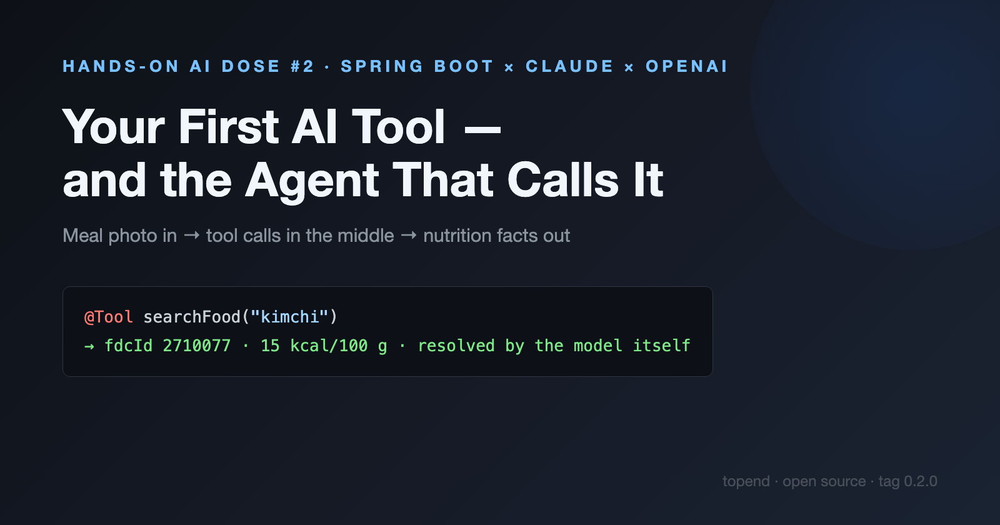
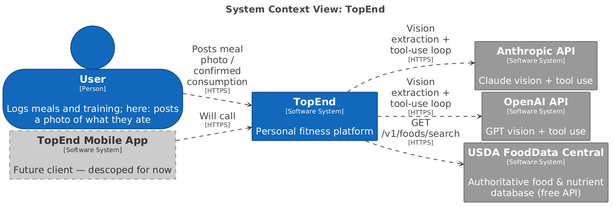
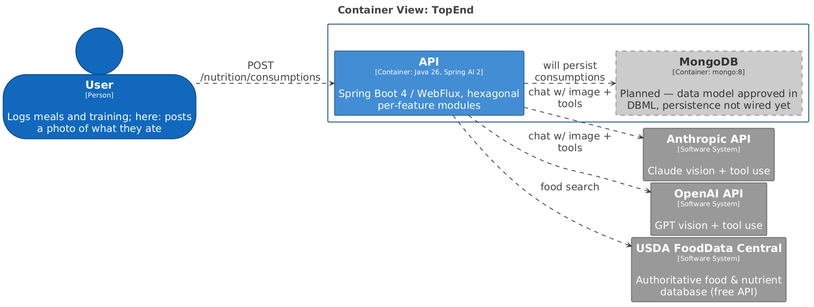
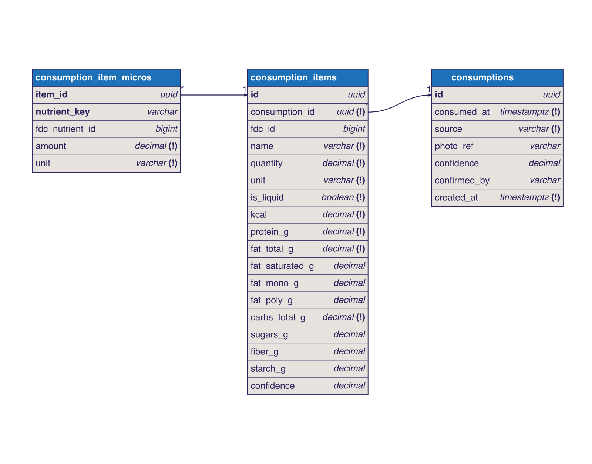
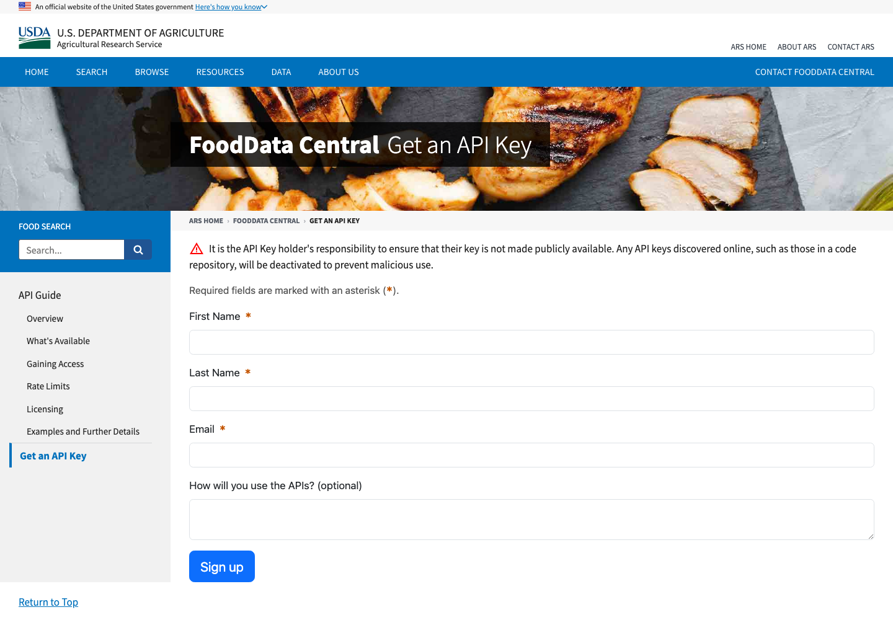
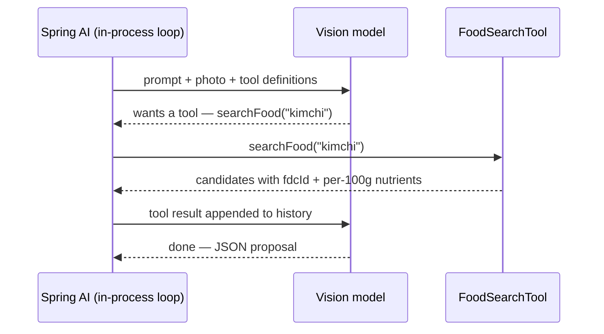
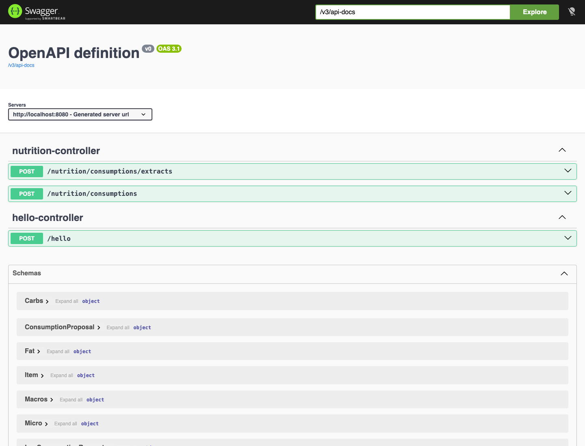
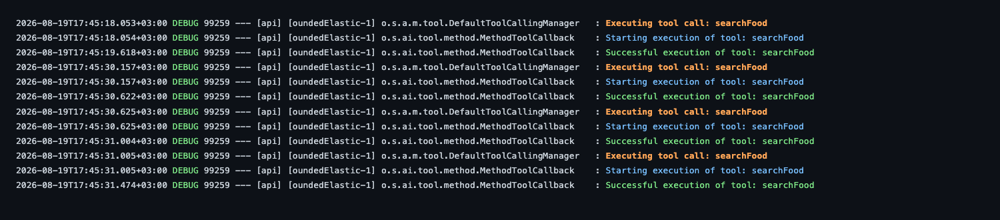

# Hands-On AI Dose #2 — Your First AI Tool, and the Agent That Calls It

*Post a photo of your meal; the model identifies the foods, then calls back into your Spring Boot code to resolve them against the USDA food database.*



---

*Previous: [Hands-On AI Dose #1 — Two AI Providers, One Spring Boot Endpoint](https://medium.com/@kemonoske/hands-on-ai-dose-1-two-ai-providers-one-spring-boot-endpoint-98af965ec7fa?sk=bc70994c9dd1d1c6516d139c42b40828)*

## The feature

Here's the product context. TopEnd's first feature is **meal logging**. Every nutrition app learns the same lesson: manual entry is where users quit — nobody weighs their kimchi and types four micronutrients into a form. So the API ships a **raw agentic extractor** alongside the manual endpoint: photo in, structured proposal out, human confirms. Raw is the honest word — we'll improve it dose by dose, and the numbers at the end of this article show exactly why.

One thing a photo can't give you is trustworthy nutrient data — models happily invent calorie counts. For that we need a **nutrient catalogue**, and USDA's FoodData Central is exactly that: the reference database for whole foods, with a free API. The model identifies; FDC supplies the facts.

Dose #1 ([backlink](https://medium.com/@kemonoske/hands-on-ai-dose-1-two-ai-providers-one-spring-boot-endpoint-98af965ec7fa?sk=bc70994c9dd1d1c6516d139c42b40828)) left us with a Spring Boot 4 API talking to Claude or OpenAI behind one config switch. Today the model stops being a chatbot: it gets a **tool** — a method in our codebase it can decide to call.

## The architecture

The request flow:

```mermaid
flowchart LR
  Client["curl / Swagger UI"] -->|"photo (multipart)"| C["NutritionController"]
  C --> S["ConsumptionService"]
  S --> P{{"VisionExtractionPort"}}
  P -.-> A["Anthropic / OpenAI<br/>ExtractionAdapter"]
  A -->|"image + prompt + tools"| M[("Vision model")]
  M -->|"searchFood('kimchi')"| T["FoodSearchTool @Tool"]
  T --> F["FdcClient"]
  F --> U[("USDA FoodData Central")]
  M -->|"JSON proposal"| A
```



Where that sits in the system — TopEnd talks to three external parties now: two AI providers and one database of record. The mobile app is on the diagram because it's the plan, and greyed out because it's not the priority:



Inside the system, one container does the work today. Mongo is drawn dashed for a reason — it's *planned*, and no persistence code exists yet:



The data model got designed before it got persisted (DBML in `docs/dbml/`, ADRs in `docs/adr/`):



Three tables. `consumptions` is the meal event; `consumption_items` carries macros and their subtypes as columns because you always query them; `consumption_item_micros` is key-value rows so a new micronutrient never needs a migration. FDC's shape leaks in deliberately: items store totals for the consumed quantity converted from FDC's per-100g values, micros keep FDC's unit names. Until the model earns a database, storage is a `ConcurrentHashMap` behind the service (ADR-0003).

Two endpoints come out of this: `POST /nutrition/consumptions/extracts` (multipart photo → AI proposal) and `POST /nutrition/consumptions` (JSON → store the confirmed meal). Proposal and confirmation are different resources because FR-NUT-2 is a product rule: AI proposes, the human confirms.

## Step 1 — Get a free USDA FoodData Central API key



Sign up at https://fdc.nal.usda.gov/api-key-signup — the key arrives by email instantly. Free, 1,000 requests/hour. `DEMO_KEY` works for a quick poke, but at 30 requests/hour one busy plate exhausts it: our bibimbap alone triggered ~10 tool calls.

Configured like the AI keys, env var referenced from `application.yaml`:

```yaml
fdc:
  api-key: ${FDC_API_KEY:}
```

## Step 2 — A thin client for the food API

Let's start with a test. No third-party mock library needed — Spring's own `MockRestServiceServer` plays USDA:

```java
private final RestClient.Builder builder = RestClient.builder();
private final MockRestServiceServer server = MockRestServiceServer.bindTo(builder).build();
private final FdcClient client = new FdcClient(builder, "https://api.nal.usda.gov/fdc", "test-api-key");

@Test
void searchesFoodsAndMapsResults() {
    server.expect(requestTo(startsWith("https://api.nal.usda.gov/fdc/v1/foods/search")))
        .andExpect(queryParam("query", "apple"))
        .andExpect(queryParam("api_key", "test-api-key"))
        .andRespond(withSuccess(cannedFdcJson, MediaType.APPLICATION_JSON));

    List<FdcClient.FoodSearchResult> results = client.search("apple");

    assertThat(results.getFirst().fdcId()).isEqualTo(1750340L);
}
```

Green comes cheap — `FdcClient` is ~30 lines of `RestClient`, and the only part that matters is the call itself:

```java
public List<FoodSearchResult> search(String query) {
    return restClient.get()
        .uri(uri -> uri.path("/v1/foods/search")
            .queryParam("query", query)
            .queryParam("pageSize", PAGE_SIZE)
            .queryParam("api_key", apiKey)
            .build())
        .retrieve()
        .body(SearchResponse.class)
        .foods();
}
```

The base URL comes in through the constructor, which is what lets the test above exist at all.

## Step 3 — Your first AI tool

This is the whole trick:

```java
@Component
public class FoodSearchTool {

    private final FdcClient fdcClient;

    @Tool(description = "Search USDA FoodData Central for a food by name. Returns candidate foods with "
            + "their FDC id and nutrient values per 100 g/ml (energy KCAL, protein, fat, carbs, micronutrients).")
    public List<FdcClient.FoodSearchResult> searchFood(
            @ToolParam(description = "Plain food name, e.g. 'red apple' or 'grilled chicken breast'") String query) {
        return fdcClient.search(query);
    }
}
```

Three things worth staring at:

1. **The description is the API.** The model never sees your code — it sees the description and the parameter schema. Write them for the model, not for your teammates. Ours states the units (`per 100 g/ml`) because the model has to do portion math with the results.
2. **Spring AI translates this once per provider.** The same `@Tool` becomes an Anthropic `tools` entry and an OpenAI function definition. Register once, both providers can call it.
3. **It returns your domain objects.** Spring AI serializes the result back to the model as JSON. No manual marshalling.

## Step 4 — The agent: image in, tool calls in the middle, JSON out

The extraction adapter mirrors Dose #1's pattern — one adapter per provider, selected by `spring.ai.default`:

```java
@Override
public Mono<ConsumptionProposal> extract(byte[] image, String mimeType) {
    return Mono.fromCallable(() -> chatClient.prompt()
        .user(u -> u.text(EXTRACTION_PROMPT)
            .media(MimeTypeUtils.parseMimeType(mimeType), new ByteArrayResource(image)))
        .tools(foodSearchTool)
        .call()
        .entity(ConsumptionProposal.class, params -> params.useProviderStructuredOutput()))
        .subscribeOn(Schedulers.boundedElastic());
}
```

Three Spring AI features stack in one call chain:

- **Multimodal input** — `media(...)` attaches the photo bytes.
- **Tool calling** — `tools(foodSearchTool)` hands the model our tool.
- **Structured output** — `entity(ConsumptionProposal.class, params -> params.useProviderStructuredOutput())` derives a JSON schema from a Java record and — the part that matters — sends it **natively**: Anthropic's [structured outputs](https://platform.claude.com/docs/en/build-with-claude/structured-outputs) and OpenAI's [structured outputs](https://developers.openai.com/api/docs/guides/structured-outputs) enforce the schema server-side, so the reply *is* the record. Without that flag Spring AI falls back to pasting the schema into the prompt and hoping — we tried that first; Claude opened its answer with "Based on the photo…" and broke the parser.

### Who runs the agentic loop?

When the model wants the tool, the API doesn't return an answer — it returns a request to call it (Anthropic: `stop_reason: "tool_use"`; OpenAI: `finish_reason: "tool_calls"`). Someone must execute the tool, append the result to the conversation, and send everything back, repeatedly, until the model finishes normally (`end_turn` / `stop`). That cycle is the **agentic loop**:



Spring AI implements this whole mechanism and runs it inside `call()` — the dispatch, the history bookkeeping, the termination check. We're deliberately not opening that box today; it deserves its own dose. If you want the raw-API version, [the certification guide's agentic-loops chapter](https://claudecertificationguide.com/learn/1-agentic-architecture/1-1-agentic-loops) walks through why `stop_reason` is the only correct termination signal. And when you need manual control — human approval per tool call, streaming progress — `internalToolExecutionEnabled(false)` hands you the loop.

## Step 5 — Watch it work



Debug logging (`logging.level.org.springframework.ai=DEBUG`) makes the loop visible — the model resolving a bibimbap bowl, one `searchFood` call per ingredient:



The repo pins two human-classified photos from Wikimedia Commons as fixtures, and an opt-in integration test (`ExtractionAgentIT`) runs the real loop against them on both providers — red→green applies to agents too.

The test run also produced the most instructive non-result of the day. The plate had Korean fernbrake (gosari) on it; FDC doesn't have it. The model returned `fdcId=null, kcal=0, confidence=0.4` for that item and moved on. No invented numbers — the prompt allows "not found", and the human-confirmation step exists exactly for this case.

## What did today cost?

The meter reading for one day of building and debugging this:

| Provider | Tokens | ≈ Cost |
|---|---|---|
| OpenAI (gpt-5-mini) | 1,665,728 across 31 calls | ~$0.36 |
| Anthropic (claude-haiku-4-5) | 392,868 in / 12,756 out | ~$0.45 |

Eighty-one cents sounds harmless until you do the per-photo math: **one meal photo costs ~150–250k tokens**. The agentic loop replays the entire conversation on every tool round — image, prompt, and every previous tool result get re-billed on each of the ~11 requests a busy plate triggers. Our `searchFood` result makes it worse: 5 candidates × full FDC nutrient arrays, thousands of tokens, re-read every round. On a frontier-class model this exact design would cost dollars per photo.

To be explicit about what today's code is: **we built the fastest, dirtiest version that works and did not optimize anything.** That's a statement of sequencing, not an apology — you can't optimize a loop you haven't watched run. Making it cheap is its own story, with its own instrument panel.

## Things to consider

- **Reasoning models are token hungry.** They spend output tokens on thinking you never see. `gpt-5-nano` with a 2,048-token budget returned literally nothing — the budget went to reasoning, none was left for the answer. Budget 8k+ for structured extraction, and check the `finish_reason` before trusting an empty reply.
- **Use native structured outputs, not prompt-and-pray.** Both [Claude](https://platform.claude.com/docs/en/build-with-claude/structured-outputs) and [OpenAI](https://developers.openai.com/api/docs/guides/structured-outputs) enforce a JSON schema server-side. Our first version parsed prose-wrapped JSON with string slicing; the native flag deleted that code entirely.
- **Strict schemas forbid open maps.** Native structured output only works if the schema is *closed*: every key the model may emit has to be named up front. A `Map<String, Double>` is the opposite — its keys are invented at runtime (`"iron"`, `"vitaminC"`, whatever the model picks), so there is nothing to name, and both providers reject the schema outright. The fix is to stop using the key as data: instead of `{"iron": 1.8}`, emit `[{"nutrientKey": "iron", "amount": 1.8, "unit": "mg"}]` — a fixed shape repeated N times. Same information, and now every field has a name the schema can pin down.
- **A busy plate is a long turn.** Ten ingredients means ten sequential tool rounds; our first run blew past the HTTP client's read timeout. `spring.ai.openai.chat.timeout: 10m`.
- **Bound your uploads.** WebFlux's 256KB multipart default rejects any real photo, and raising it naively invites unbounded buffering. We cap the in-memory join at 10MB and return `413` past it — the providers reject bigger images anyway.

Those last two are load-bearing questions in disguise: a ten-minute timeout on a request-response endpoint and a whole photo buffered in memory are both things a real deployment would answer with async handling and streaming instead. Not today — today the loop just has to run.

## Code

Everything is tagged: [github.com/…/topend-app @ 0.2.0](https://github.com/ion-bostanica/topend.app/tree/0.2.0)

## Next

Dose #1 wired two providers into one endpoint ([read it here](https://medium.com/@kemonoske/hands-on-ai-dose-1-two-ai-providers-one-spring-boot-endpoint-98af965ec7fa?sk=bc70994c9dd1d1c6516d139c42b40828)); today they both learned to call our code. Dose #3 puts the agent on a scale: **Micrometer** metrics on every model call, so "tokens per photo" becomes a number on a dashboard — then we cut the bill lever by lever (slim tool results, batched lookups, math out of the model, prompt caching) with before/after receipts. Target: the same bibimbap for under a cent.
